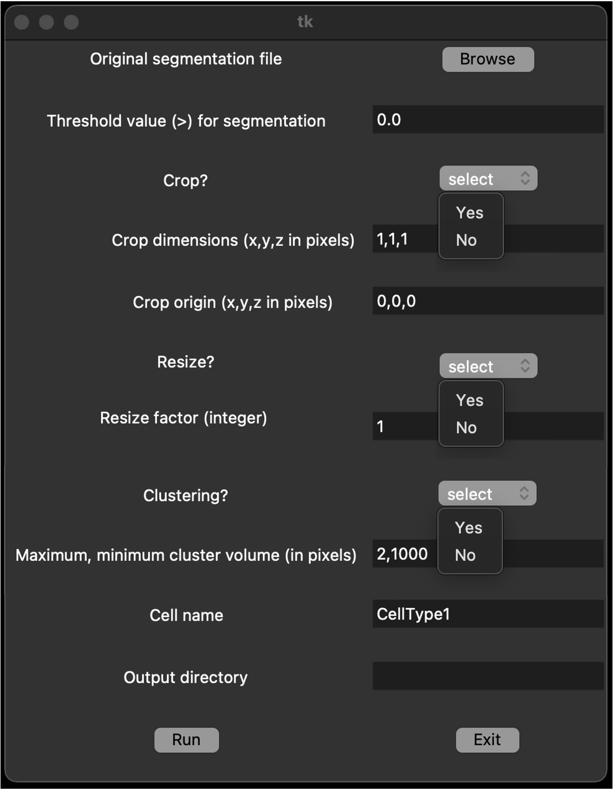

# Clustering tool for computational modeling applications in radiobiology

This computational tool performs the clustering of voxels of biological segmentation images to create biological structures (e.g., cells and nuclei) based on user-defined parameters. In addition, it converts the information contained in the images into file formats that allow importing the geometries into software dedicated to the Monte Carlo simulation of radiation transport ([TOPAS](https://opentopas.github.io)) and biological processes ([CompuCell3D](https://compucell3d.org)). Overall, this tool aims to ease the use of realistic biological geometries in computational radiobiological studies.  

This tool is described in the following publication: [https://dx.doi.org/10.1088/1361-6560/ad7f1d](https://dx.doi.org/10.1088/1361-6560/ad7f1d)

## How to cite
If the tool has been useful for your studies, please acknowledge its use by citing this work:

Ortiz R and Ramos-Méndez J. A clustering tool for generating biological geometries for computational modeling in radiobiology. 2024 Phys. Med. Biol. 69 21NT01

# Getting started

## Requirements

#### To use the clustering tool

This tool is written in python3 (v3.11) and C++ (v.14). Thus, we recommend to install python (v3.8 or superior) and C++ (v.14) in your system following the offical instructions for their installation in your operting system, if you have not done it yet.
Alongside with python default libraries, this tool requires:

- pydicom
- scipy
- numpy
- matplotlib
- nibabel
- tkinter (optional, for gui mode, see below)

Please follow the official python instructions to install these libraries (at python.org).

## How to use

This tool is run from a terminal window.
To print usage instruction in the terminal, type:
```
python3 main.py 
```
> [!WARNING]
> This documentation assumes that the command to run python in your system is _python3_. It may need to be replaced by the appropriate command from your system if different.

It requires user input. Find a list of the information required:
1.	Path to the original image. The current version of the tool is compatible with TIFF, NII, and DICOM formats. Two- and three-dimensional images are supported.
2.	Threshold value for the segmentation of the image, i.e., image intensity threshold.
3.	Tag (Yes or No options) to perform the cropping of the image.
4.	The dimensions of the cropped image.
5.	The initial vertex in the image for cropping.
6.	Tag (Yes or No options) to perform the resizing of the image.
7.	The resizing factor, i.e., factor to which the number of voxels in each direction will be reduced.
8.	Tag (Yes or No options) to perform the clustering of voxels.
9.	The minimum and maximum cluster volume (in voxels).
10.	The name of the clustered structure, e.g., Neuron.
11.	Output directory.

For a complete description of these parameters, please see the publication [https://dx.doi.org/10.1088/1361-6560/ad7f1d](https://dx.doi.org/10.1088/1361-6560/ad7f1d).

This information can be input in two modes: via (1) input parameter file or (2) Graphical User Interface (GUI).

#### Mode 1: input file parameter.
In this mode, a input text file with the user input informations is required. This file should contain 11 rows, each one with the information described above in the same order.

To run this mode, type:
```
 python3 main.py -m file TheNameOfYouInputFile.txt
```

> [!WARNING]
> Replace _TheNameOfYouInputFile.txt_ by the name of your input file.

> [!TIP]
> You can find an example of input file, called *inputfile_template.txt*, in the repository.

#### Mode 2: GUI.

To run this mode, type:
```
 python3 main.py -m gui
```

A GUI will pop up and you will be able to select the required parameter from _Browse_ buttons, _dropdown menus_, and _text entries_ (see the figure below). To run the script, click on _Run_.



> [!WARNING]
> This mode requires the installation of the _tkinter_ python library.

> [!NOTE]
> In both modes, if the information is not correct, _ERROR_ messages will appear in the terminal window and the geometries will not be generated.

If the required information is correct, PIF and ImageCube files will be created in a directory with the name of the _Project name_ specified. 

> [!NOTE]
> The tool may use default values if some of the information is missing. Please check the used parameters printed in the terminal window.


> [!TIP]
> The clustering process may be time consuming (from minutes to days) for large images. We recommend to crop and resize the image (see commands above) to the region of interest and to minumum acceptable spatial resolution, respectively, for computation efficiency. See examples of biological images and recommendations to reduce the execution time at [https://dx.doi.org/10.1088/1361-6560/ad7f1d](https://dx.doi.org/10.1088/1361-6560/ad7f1d).
